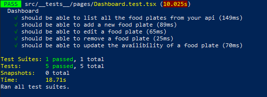

<p align="center">


<a href="https://www.linkedin.com/in/alquiponeto/">
    
</a>

<a href="https://github.com/Alquipo/GoStack12-Desafio-10-GoRestaurant-Web/commits/master">
    
</a>


</p>

<p align="center">

<a href="https://reactjs.org/">
  
</a>

</p>
<h2 align="center">
  Desafio 10: GoRestaurant Web
</h2>

## 🚀 Sobre o desafio

Nesse desafio, desenvolvi mais uma aplicação, a GoRestaurant. Agora pratiquei o que aprendi até agora no React.js junto com TypeScript, praticando o conceito de CRUD (Create, Read, Update, Delete).

Essa será uma aplicação que irá se conectar a uma fake API, e exibir os pratos de comida criados e permitir a criação, remoção e atualização desses pratos.

<p align="center">

  
</p>

## 🎨 Layout

<h4 align="center">
  
</h4>

## 🔨 Tecnologias:

- [ReactJs][reactjs]
- [TypeScript][typescript]
- [Polished](https://github.com/styled-components/polished)
- [Styled Components](https://styled-components.com/)
- [Axios][axios]

## 🚀 Como rodar este projeto

Para clonar e executar este aplicativo, você precisará de [Git](https://git-scm.com), [NodeJs][nodejs] Instalado em seu computador.

### 🌀 Clonando o repositório

```bash
# Clone este repositório
$ git clone https://github.com/Alquipo/GoStack12-Desafio-10-GoRestaurant-Web

# Acesse a pasta do projeto no terminal/cmd
$ cd
GoStack12-Desafio-10-GoRestaurant-Web
```

### 🧭 Rodando a aplicação web

```bash
# Instale as dependências
$ yarn

# Execute a fake api
$ yarn json-server server.json -p 3333

# Execute a Aplicação
$ yarn start

# Execute o teste da Aplicação
$ yarn test

# O servidor inciará na porta:3000 - acesse http://localhost:3000
```

## 🛠 Funcionalidades da aplicação

- **`Listar os pratos de comida da sua API`**: Sua página `Dashboard` deve ser capaz de exibir uma listagem, com o campo `title`, `value`, e `description` e `available` de todos os pratos de comida que estão cadastrados na sua API.

* **`Adicionar novos pratos de comida a sua API`**: Em sua página Dashboard você deve abrir um modal ao clicar no botão `Novo Prato` no Header. Esse modal deve ser responsável por cadastrar uma nova `food` passando os campos `image`, `name`, `description`, `value`.

- **`Editar pratos de comida da sua API`**: Em sua página Dashboard você deve abrir um modal ao clicar no botão `Editar Prato`. Esse modal deve ser responsável por editar uma `food` passando os campos `image`, `name`, `description`, `value`.

* **`Remover pratos de comida da sua API`**: Em sua página Dashboard você deve remover um prato de comida ao clicar no botão com ícone de lixeira no componente Food.

- **`Alterar disponibilidade dos pratos de comida da sua API`**: Em sua página Dashboard você deve alterar a disponibilidade de um prato de comida ao clicar no switch que é controlado pelo valor de `available`.

## 🤔 Como contribuir para o projeto

- Faça um **fork** do projeto;
- Crie uma nova branch com as suas alterações: `git checkout -b my-feature`
- Salve as alterações e crie uma mensagem de commit contando o que você fez:`git commit -m "feature: My new feature"`
- Envie as suas alterações: `git push origin my-feature`

> Caso tenha alguma dúvida confira este [guia de como contribuir no GitHub](https://github.com/firstcontributions/first-contributions)

## 📝 Licença

Este projeto esta sobe a licença MIT. Veja a [LICENÇA][license] para saber mais.

Feito com ❤️ por Alquipo Neto 👋🏽 [Entre em contato!](https://www.linkedin.com/in/alquiponeto/)

[nodejs]: https://nodejs.org/
[express]: https://expressjs.com/
[uuidv4]: https://www.npmjs.com/package/uuidv4
[nodemon]: https://www.npmjs.com/package/nodemon
[rs]: https://rocketseat.com.br
[license]: https://opensource.org/licenses/MIT
[postgres]: https://www.postgresql.org/
[multer]: https://www.npmjs.com/package/multer
[reactjs]: https://reactjs.org/
[axios]: https://www.npmjs.com/package/axios
[babel]: https://babeljs.io/
[webpack]: https://webpack.js.org/
[rs]: https://rocketseat.com.br
[license]: https://opensource.org/licenses/MIT
[typescript]: https://www.typescriptlang.org/
